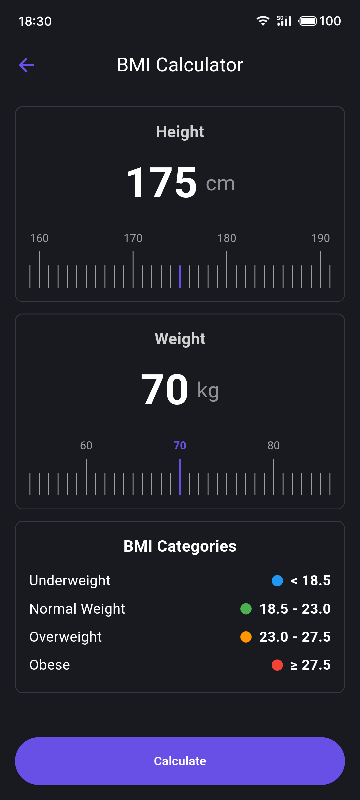

<h4 align="right">English | <strong><a href="README_CN.md">中文</a></strong></h4>

<div align="center">
    <h2>📢 Recommended App</h2>
    <p>This BMI calculator is just one feature of the Snibox all-in-one toolbox.</p>
    <p>Want to experience more useful tools? Download Snibox for a comprehensive productivity boost!</p>
    <div align="center">
    
    <h1 style="border-bottom: none;">Snibox</h1>
   </div>
    <a href="https://apps.apple.com/app/snibox/id">
        
    </a>
</div>

## BMI Calculator

This is a BMI (Body Mass Index) calculator application developed using Flutter. It provides an intuitive user interface to calculate BMI and offers health advice based on the calculation results.

### Features

- Custom ruler input for height and weight
- Real-time BMI calculation
- Health status display with color coding based on BMI value
- Health advice provided based on BMI
- Support for Asian and non-Asian BMI standards
- Display of BMI category table
- Haptic feedback on ruler sliding (on supported devices)

### Screenshots

<table>
  <tr>
    <td></td>
    <td></td>
  </tr>
</table>

### Installation

1. Ensure that Flutter is installed in your development environment. If not, follow the [Flutter official documentation](https://flutter.dev/docs/get-started/install) for installation.

2. Clone this repository:
   ```
   git clone https://github.com/aidevjoe/BMI-Calculator.git
   ```

3. Navigate to the project directory:
   ```
   cd bmi-calculator
   ```

4. Get dependencies:
   ```
   flutter pub get
   ```

5. Run the application:
   ```
   flutter run
   ```

### Dependencies

- flutter: SDK
- vibration: ^2.0.0

### Usage Instructions

1. After launching the app, you'll see two rulers for inputting height and weight.
2. Slide the rulers to adjust your height and weight.
3. Click the "Calculate" button to compute your BMI.
4. View your BMI result, health status, and advice.
5. Refer to the BMI category table at the bottom to understand different BMI ranges.

### Customization

- The app automatically selects Asian or non-Asian BMI standards based on the device's language settings. You can modify the `_checkIfAsian()` method to adjust this behavior.
- BMI categories and corresponding health advice can be customized in the `_bmiCategories` and `_calculateBMI()` methods.

### Contributing

Issues and pull requests are welcome. For major changes, please open an issue first to discuss what you would like to change.

### License

[MIT](https://choosealicense.com/licenses/mit/)