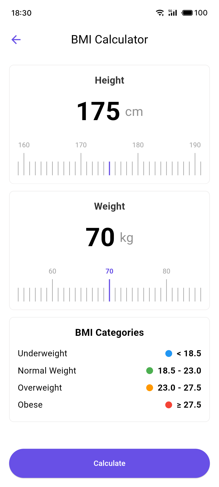
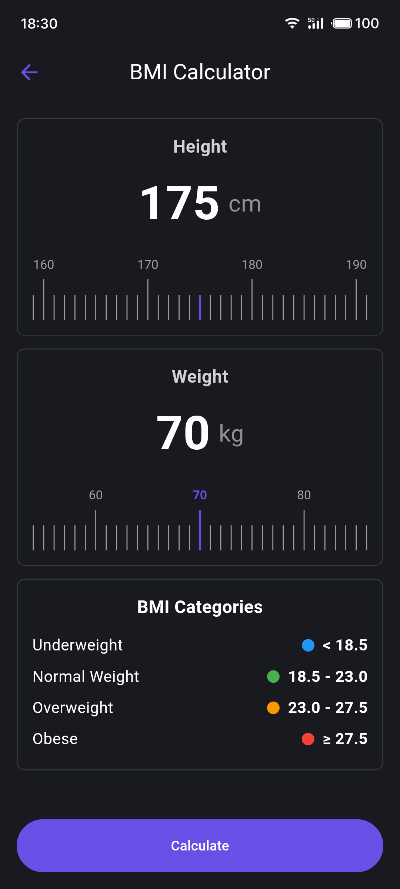

# BMI 计算器 / BMI Calculator

<h4 align="right"><strong><a href="README.md">English</a></strong> | 中文</h4>

<div align="center">
    <h2>📢 推荐应用</h2>
    <p>这个BMI计算器只是Snibox全能工具箱中的一个功能。想要体验更多实用工具吗？</p>
    <p>下载Snibox，享受一站式效率提升体验！</p>

<div align="center">
    
    <h1 style="border-bottom: none;">Snibox</h1>
</div>
    <a href="https://apps.apple.com/app/snibox/id">
        
    </a>
</div>

## BMI 计算器

这是一个使用Flutter开发的BMI (Body Mass Index) 计算器应用。它提供了一个直观的用户界面来计算BMI,并根据计算结果提供健康建议。

### 功能

- 使用自定义标尺输入身高和体重
- 实时计算BMI
- 根据BMI值显示健康状态和颜色编码
- 提供基于BMI的健康建议
- 支持亚洲和非亚洲BMI标准
- 显示BMI分类表
- 标尺滑动时的触觉反馈 (在支持的设备上)

### 截图

<table>
  <tr>
    <td></td>
    <td></td>
  </tr>
</table>

### 安装

1. 确保你的开发环境中已安装了Flutter。如果没有,请按照[Flutter官方文档](https://flutter.dev/docs/get-started/install)进行安装。

2. 克隆此仓库:
   ```
   git clone https://github.com/aidevjoe/BMI-Calculator.git
   ```

3. 进入项目目录:
   ```
   cd bmi-calculator
   ```

4. 获取依赖:
   ```
   flutter pub get
   ```

5. 运行应用:
   ```
   flutter run
   ```

### 依赖

- flutter: SDK
- vibration: ^2.0.0

### 使用说明

1. 启动应用后,你会看到两个标尺,分别用于输入身高和体重。
2. 滑动标尺调整你的身高和体重。
3. 点击"Calculate"按钮计算BMI。
4. 查看你的BMI结果、健康状态和建议。
5. 参考底部的BMI分类表了解不同BMI范围的含义。

### 自定义

- 该应用会根据设备的语言设置自动选择亚洲或非亚洲BMI标准。你可以修改`_checkIfAsian()`方法来调整这个行为。
- BMI分类和相应的健康建议可以在`_bmiCategories`和`_calculateBMI()`方法中进行自定义。

### 贡献

欢迎提交问题和拉取请求。对于重大更改,请先开issue讨论您想要改变的内容。

### 许可

[MIT](https://choosealicense.com/licenses/mit/)

---